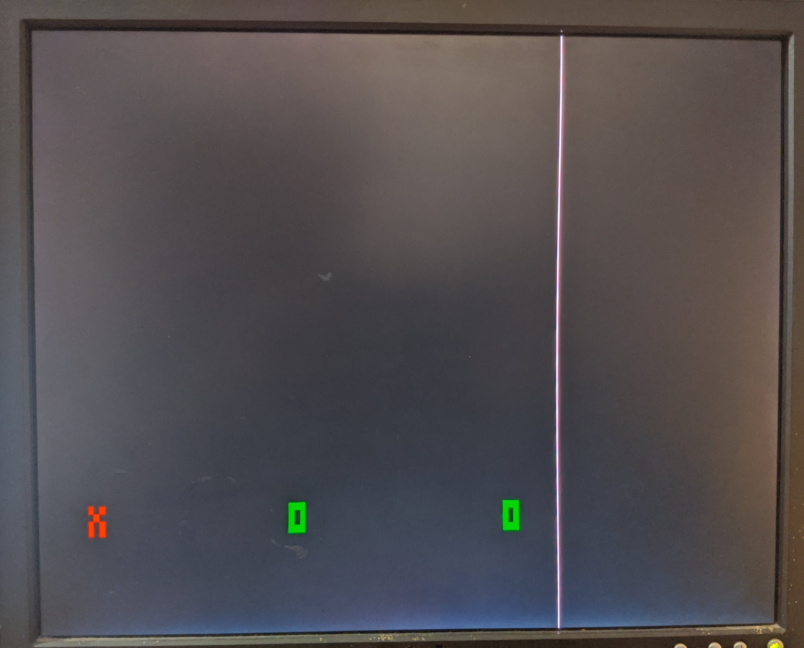

How to run:
-------
clone the repo, run ardu.ino on the microcontroller, and run dino.py on the host computer connected to the microcontroller.

Requirements:
-------------
### hardware
some resistors, a vga cable , a monitor
which supports vga input and an arduino
uno. Follow this [link](https://github.com/smaffer/vgax) to setup.
### os
It has only been tested on ubuntu, and probably only work on *nix systems.

About
-----
The project is based on [this](https://github.com/smaffer/vgax) awesome vga library.

The game is written in python(dino.py) which manages all sprite positions and game logic, and sends out only positions of sprites via serial to the uno.

This is how the data is sent:

    [dino.py] -> [game_engine.py] -> [server.py] ---serial--> uno

SCREENS
-------

*a dummy screen showing alphabets as characters. I forgot to record the normal sprites in action :(*

Make new games:
---------------
TODO

